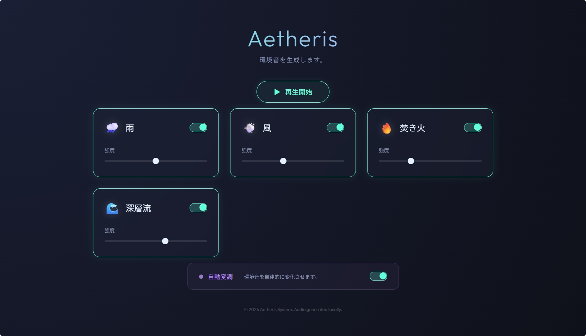

# Aetheris

Web Audio APIを利用した、ブラウザだけで動作する環境音ジェネレーターです。
録音された音声ファイルのループではなく、プログラムによってリアルタイムに音を合成しています。

## 概要

雨、風、焚き火、深層流（ブラウンノイズ）の4つの音源を重ね合わせることで、好みの環境音を作れます。
作業用BGMや、リラックスしたい時などにどうぞ。

## 機能

- **4つのサウンドレイヤー**: 雨・風・焚き火・ブラウンノイズの音量を個別に調整可能。
- **リアルタイム生成**: Web Audio APIのオシレーターとノイズ生成を使っているため、パターンがループすることなく、常に変化し続けます。
- **自動変調モード**: ONにすると、風の強さや雨の激しさなどが時間とともにランダムに揺らぎます。

## 使い方

1. `index.html` をブラウザで開いてください。（Chrome推奨）
2. 画面上の「再生開始」ボタンを押すと音が鳴ります。

※ローカルファイルの直接オープン(`file://`)でも動作しますが、CORS制限などを避けるため、VS CodeのLive Server拡張機能などを使ってローカルサーバー経由で開くのが確実です。

## 技術

- HTML / CSS / Vanilla JS
- Web Audio API
